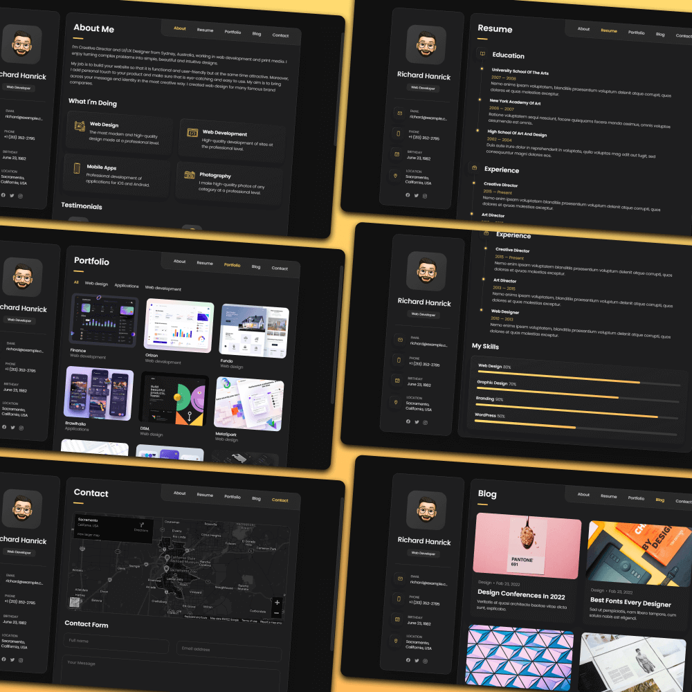

# Mehul Jariwala - Full Stack Engineer Portfolio

[](https://your-portfolio-url.com)
[](https://www.linkedin.com/in/mehul-jariwala)
[](https://github.com/mehul-jariwala)
[](mailto:mjariwala98@gmail.com)

A modern, responsive personal portfolio website showcasing my expertise as a Full Stack Engineer with 5+ years of experience in AI, web development, and enterprise solutions.

## 🚀 Live Demo




## ✨ Features

### 🎯 **Core Functionality**
- **Responsive Design**: Fully responsive across all devices (desktop, tablet, mobile)
- **Modern UI/UX**: Clean, professional design with smooth animations and transitions
- **Interactive Portfolio**: Detailed project showcases with comprehensive information
- **Dynamic Blog System**: Interactive blog posts with modal popups
- **Contact Form**: Integrated EmailJS for seamless communication
- **Real-time Animations**: Smooth scrolling, hover effects, and interactive elements

### 📱 **Portfolio Section**
- **Project Details Modal**: Comprehensive project information including:
  - **Tech Skills**: Complete technology stack used
  - **Role**: Your specific role and responsibilities
  - **Team Size**: Number of team members involved
  - **Project Duration**: Timeline for each project
  - **Involvement**: Detailed description of contributions
  - **Key Features**: List of main project features
  - **Challenges & Solutions**: Technical challenges and solutions
  - **Results & Impact**: Measurable outcomes and business impact

### 📝 **Blog System**
- **Dynamic Content**: Blog posts loaded from JavaScript data files
- **Category Filtering**: Filter posts by technology categories
- **Modal Popups**: Detailed blog content in interactive modals
- **Rich Content**: Support for code snippets, images, and formatted text

### 🎨 **Design Features**
- **Dark Theme**: Professional dark color scheme
- **Smooth Animations**: CSS transitions and JavaScript animations
- **Interactive Elements**: Hover effects, button animations, and transitions
- **Accessibility**: WCAG compliant design with proper contrast and navigation

## 🛠️ Technologies Used

### **Frontend**
- **HTML5**: Semantic markup and modern HTML features
- **CSS3**: Advanced styling with Flexbox, Grid, and animations
- **JavaScript (ES6+)**: Modern JavaScript with classes, modules, and async/await
- **Ionicons**: Professional icon library for UI elements

### **Backend & Services**
- **EmailJS**: Client-side email service for contact form
- **Google Maps API**: Interactive location mapping
- **Google Fonts**: Poppins font family for typography

### **Development Tools**
- **Git**: Version control and collaboration
- **VS Code**: Development environment
- **Browser DevTools**: Debugging and optimization

## 📁 Project Structure

```
vcard-personal-portfolio/
├── assets/
│   ├── css/
│   │   └── style.css              # Main stylesheet with responsive design
│   ├── images/
│   │   ├── clients/               # Company logos
│   │   ├── home/                  # Portfolio showcase images
│   │   ├── blog-*.svg            # Blog post illustrations
│   │   └── project-*.jpg/png     # Project screenshots
│   └── js/
│       ├── script.js             # Main JavaScript functionality
│       ├── project-data.js       # Detailed project information
│       ├── blog-data.js          # Blog posts data
│       └── blog-data-2.js        # Additional blog content
├── website-demo-image/
│   ├── desktop.png               # Desktop preview
│   └── mobile.png                # Mobile preview
├── index.html                    # Main HTML file
├── EMAILJS_SETUP.md             # EmailJS configuration guide
└── README.md                    # Project documentation
```

## 🚀 Getting Started

### Prerequisites
- A modern web browser (Chrome, Firefox, Safari, Edge)
- A local web server (optional, for development)

### Installation

1. **Clone the repository**
   ```bash
   git clone https://github.com/mehul-jariwala/vcard-personal-portfolio.git
   cd vcard-personal-portfolio
   ```

2. **Open the project**
   - **Option 1**: Open `index.html` directly in your browser
   - **Option 2**: Use a local server for development
     ```bash
     # Using Python
     python -m http.server 8000
     
     # Using Node.js
     npx http-server
     
     # Using PHP
     php -S localhost:8000
     ```

3. **Access the website**
   - Open your browser and navigate to `http://localhost:8000` (if using a server)
   - Or simply open `index.html` in your browser

## ⚙️ Configuration

### EmailJS Setup
1. Sign up for a free account at [EmailJS](https://www.emailjs.com/)
2. Create a new service (Gmail, Outlook, etc.)
3. Create an email template
4. Get your Public Key, Service ID, and Template ID
5. Update the configuration in `script.js`:
   ```javascript
   const EMAILJS_PUBLIC_KEY = 'your_public_key';
   const EMAILJS_SERVICE_ID = 'your_service_id';
   const EMAILJS_TEMPLATE_ID = 'your_template_id';
   ```

### Customization
- **Personal Information**: Update contact details in `index.html`
- **Project Data**: Modify `assets/js/project-data.js` with your projects
- **Blog Content**: Update `assets/js/blog-data.js` and `blog-data-2.js`
- **Styling**: Customize colors, fonts, and layout in `assets/css/style.css`

## 📱 Responsive Design

The portfolio is fully responsive and optimized for:
- **Desktop**: 1200px and above
- **Tablet**: 768px - 1199px
- **Mobile**: 320px - 767px

## 🎯 Key Sections

### 1. **About Me**
- Professional summary and experience
- Core services and expertise areas
- Client testimonials and achievements
- Company logos and partnerships

### 2. **Resume**
- Detailed work experience timeline
- Educational background
- Comprehensive skills matrix
- Key achievements and contributions

### 3. **Portfolio**
- 9 detailed project showcases
- Interactive project modals
- Technology stack information
- Project outcomes and impact

### 4. **Blog**
- Technical articles and insights
- Interactive blog post modals
- Category-based filtering
- Rich content formatting

### 5. **Contact**
- Interactive contact form
- Google Maps integration
- Social media links
- Direct contact information

## 🔧 Customization Guide

### Adding New Projects
1. Add project data to `assets/js/project-data.js`
2. Include project image in `assets/images/`
3. Update the project list in `index.html`

### Adding Blog Posts
1. Add blog data to `assets/js/blog-data.js` or `blog-data-2.js`
2. Include blog image in `assets/images/`
3. The blog system will automatically load new posts

### Styling Changes
- Modify CSS variables in `:root` for color scheme
- Update typography in the font imports
- Adjust spacing and layout in respective sections

## 🌟 Performance Features

- **Optimized Images**: Compressed and properly sized images
- **Efficient CSS**: Minimal and organized stylesheet
- **Fast Loading**: Optimized JavaScript and minimal dependencies
- **Mobile First**: Responsive design with mobile-first approach
- **Accessibility**: WCAG compliant with proper semantic markup

## 📊 Browser Support

- Chrome 60+
- Firefox 55+
- Safari 12+
- Edge 79+

## 🤝 Contributing

1. Fork the repository
2. Create a feature branch (`git checkout -b feature/AmazingFeature`)
3. Commit your changes (`git commit -m 'Add some AmazingFeature'`)
4. Push to the branch (`git push origin feature/AmazingFeature`)
5. Open a Pull Request

## 📄 License

This project is licensed under the MIT License - see the [LICENSE](LICENSE) file for details.

## 📞 Contact

**Mehul Jariwala** - Full Stack Engineer

- **Email**: [mjariwala98@gmail.com](mailto:mjariwala98@gmail.com)
- **LinkedIn**: [linkedin.com/in/mehul-jariwala](https://www.linkedin.com/in/mehul-jariwala)
- **GitHub**: [github.com/mehul-jariwala](https://github.com/mehul-jariwala)
- **Twitter**: [@mjariwala98](https://x.com/mjariwala98)
- **Location**: Bangalore, India

## 🙏 Acknowledgments

- **Design Inspiration**: Modern portfolio design trends
- **Icons**: [Ionicons](https://ionic.io/ionicons) for beautiful icons
- **Fonts**: [Google Fonts](https://fonts.google.com) for typography
- **Maps**: [Google Maps](https://maps.google.com) for location services
- **Email Service**: [EmailJS](https://www.emailjs.com/) for contact form

---

⭐ **Star this repository** if you found it helpful!

**Available for new opportunities** - Let's connect and build something amazing together! 🚀